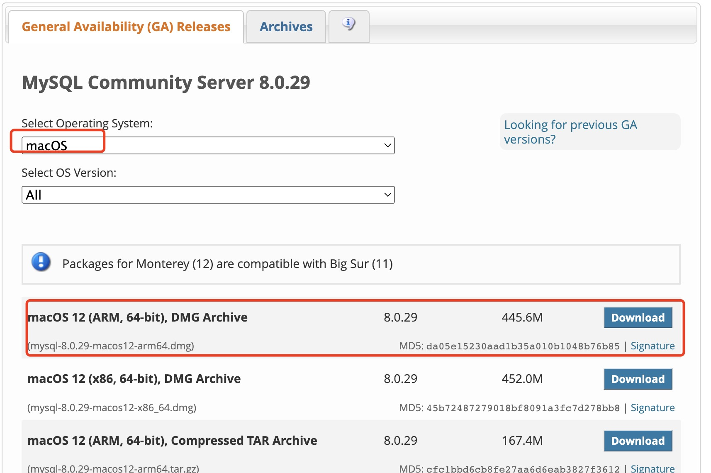
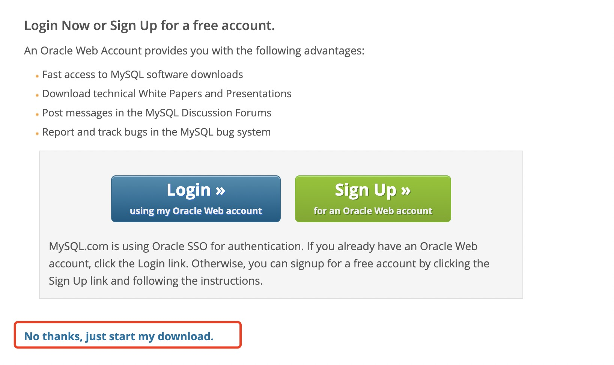
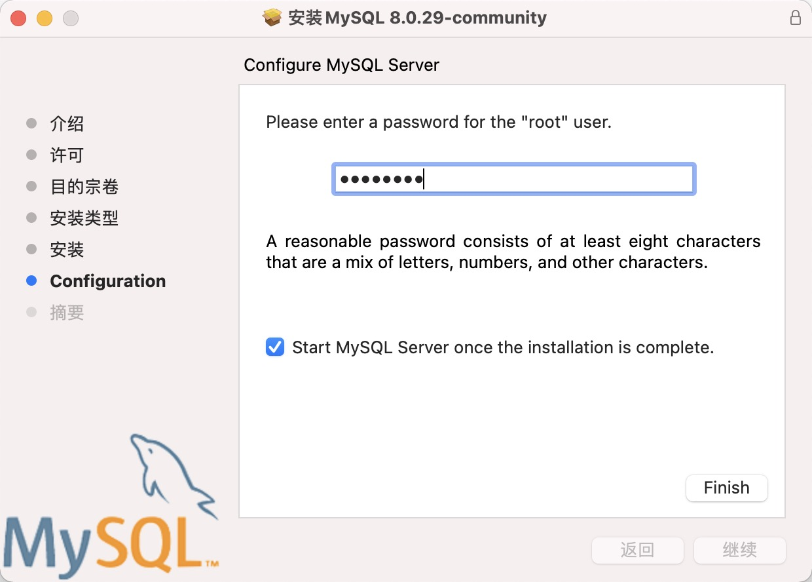

# macOS big sur(mac m1)安装mysql

## 下载mysql并安装

1、[打开官网](https://dev.mysql.com/downloads/mysql/)

2、选择下载的版本，m1是arm架构，选择arm架构的安装包


3、直接下载，不登录


4、设置密码(admin123)


## 环境变量配置：
打开终端，切换到根目录，编辑.bash_profile

```bash
cd ~
vim ./.bash_profile
```
按 i 键，进入insert模式，输入如下两行代码：

```bash
export PATH=$PATH:/usr/local/mysql/bin
export PATH=$PATH:/usr/local/mysql/support-files
source ~/.bashrc
```

按 ESC，输入  :wq  退出

执行下面的命令，使配置文件生效
```bash
source ~/.bash_profile
```
## 终端登录测试

```bash
mysql -V
zsh: command not found: mysql
```
* 若报错，则运行以下代码临时有效

```bash
alias mysql=/usr/local/mysql/bin/mysql 
```
* 若报错，希望一直有效
```bash
cd ~
vim ~/.bashrc
```
> 添加到~/.bashrc中
```bash
alias mysql=/usr/local/mysql/bin/mysql
```
> 执行下面的命令，使配置文件生效
```bash
source ~/.bashrc 
or
source ~/.bash_profile
```
检查是否生效
```bash
mysql -V
/usr/local/mysql/bin/mysql  Ver 8.0.29 for macos12 on arm64 (MySQL Community Server - GPL)
```

## 使用数据库
```bash
mysql -u root -p
```
按照提示输入数据库密码即可

## node连接mysql,node连接数据库报错:
```bash
Error [SequelizeConnectionError]: ER_NOT_SUPPORTED_AUTH_MODE: Client does not support authentication protocol requested by server; consider upgrading MySQL client
```
数据库版本
```bash
mysql -V
/usr/local/mysql/bin/mysql  Ver 8.0.29 for macos12 on arm64 (MySQL Community Server - GPL)
```
原因
mysql8.0以上加密方式，Node还不支持,登陆mysql，执行以下命令：
```bash
alter user 'root'@'localhost' identified with mysql_native_password by 'admin123';
```


