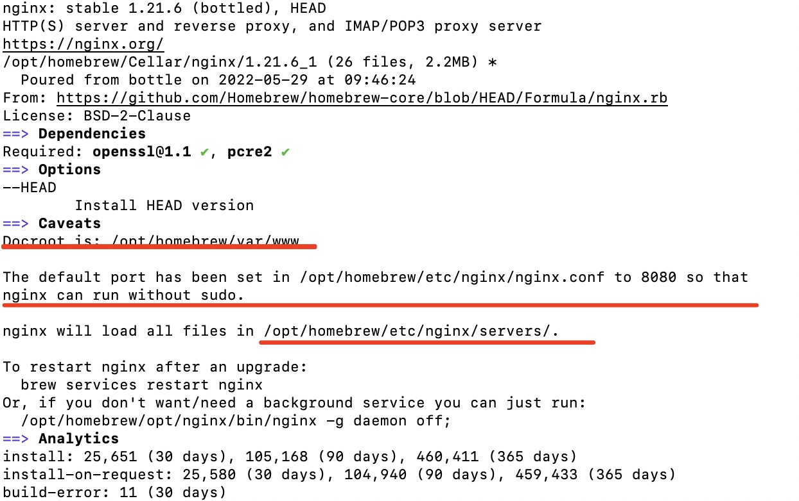
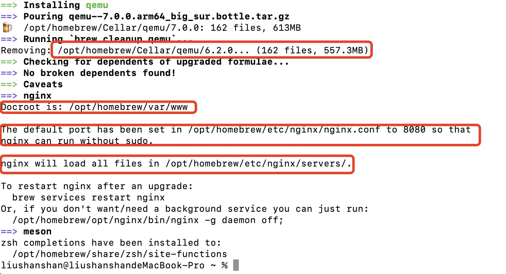
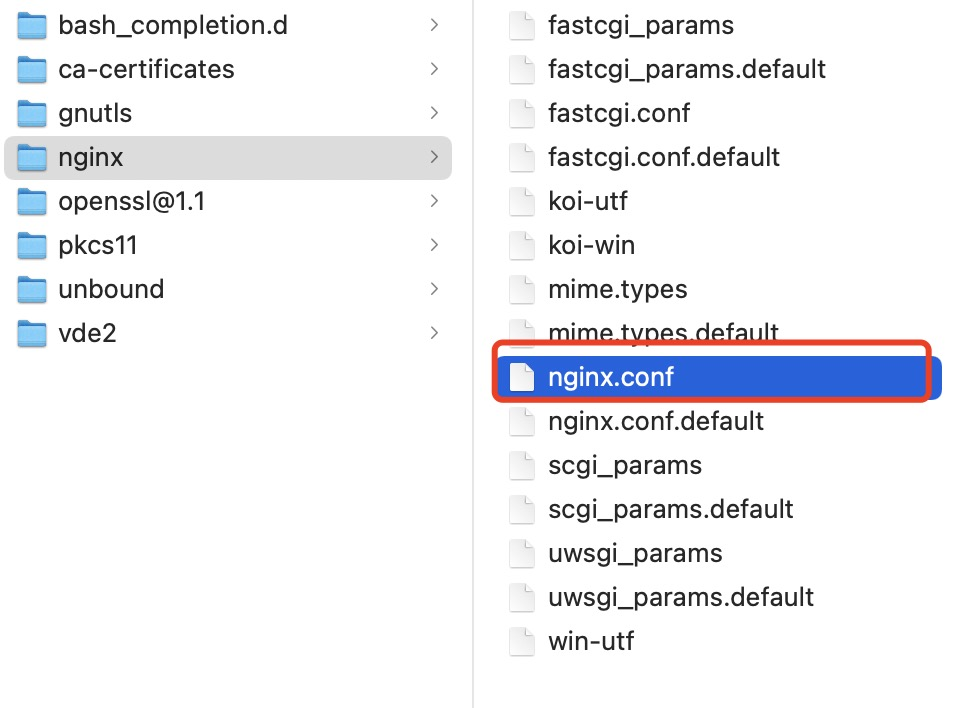
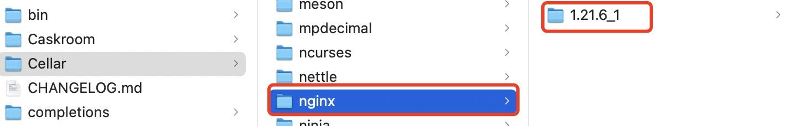
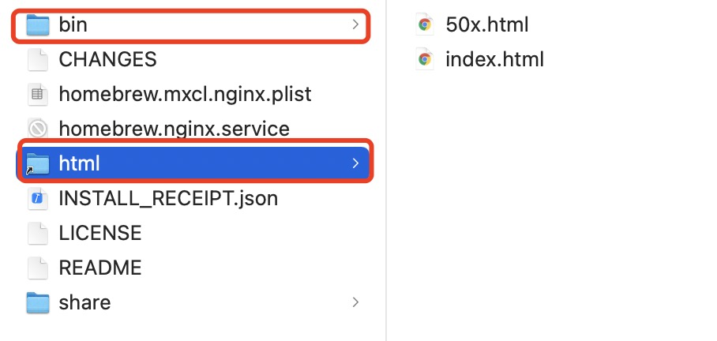
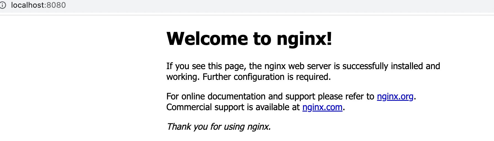

# macOS big sur(mac m1)安装nginx

## 步骤
```bash
# 查询要安装的软件是否存在
brew search nginx
```

```bash
# 查看nginx信息
brew info nginx
```


```bash
# 若未安装,则进行安装
brew install nginx
```


```bash
# 查看nginx安装目录（与brew info nginx一致）
open /opt/homebrew/etc/nginx/
```
成功打开nginx目录，也可以看到如info的nginx.conf的配置文件（后面会用到这个配置文件），非nginx安装目录



```bash
# nginx安装目录
open /opt/homebrew/Cellar/nginx
# 可执行启动文件
cd /opt/homebrew/Cellar/nginx/1.21.6_1/bin/nginx
# html 快捷方式文件夹,指向/usr/local/var/www，对应info信息中的Dcroot
cd /opt/homebrew/Cellar/nginx/1.21.6_1/html
```






```bash
# 启动nginx,未报错即启动成功,浏览器端口8080验证
nginx
```
如图所示(/opt/homebrew/var/www/index.html)，即成功

